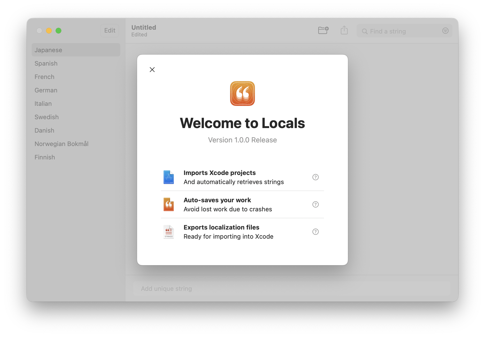
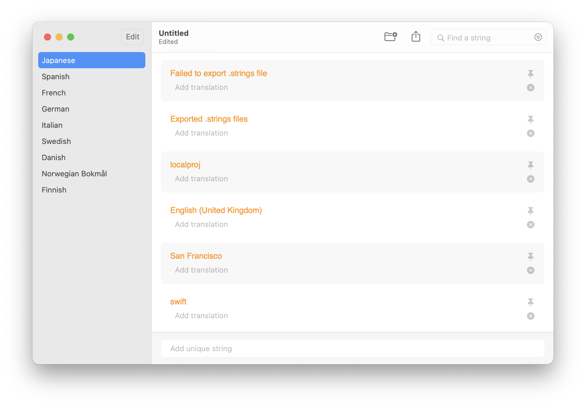
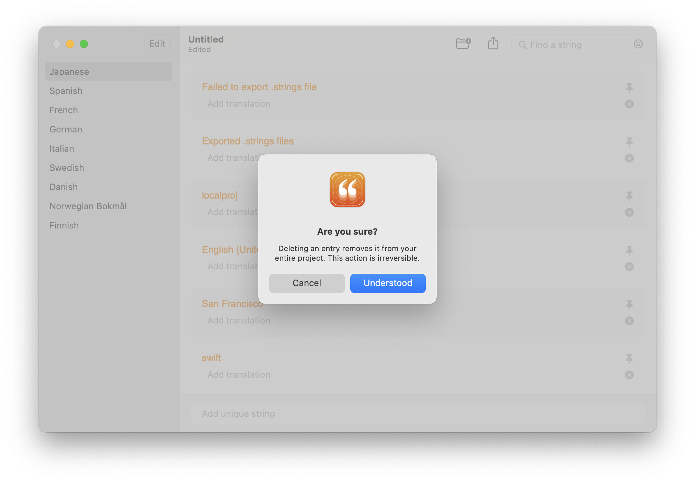
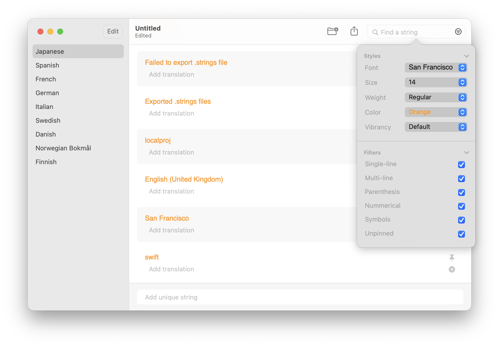

Published on the Mac App Store at [https://apps.apple.com/app/string-locals/id1565563292](https://apps.apple.com/app/string-locals/id1565563292 "https://apps.apple.com/app/string-locals/id1565563292")

 

*Auto-collect Xcode strings. Focus on translation*

String Locals makes Xcode project localization easy, by auto-collecting strings from imported Xcode project folders, so you can focus on translating your project. Your translations are exportable as .strings files, which are easily imported in Xcode for project localization.

 

**Interface**

 

 

**Views**

 

**Model**
